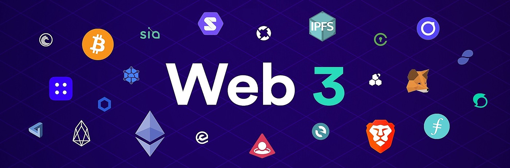
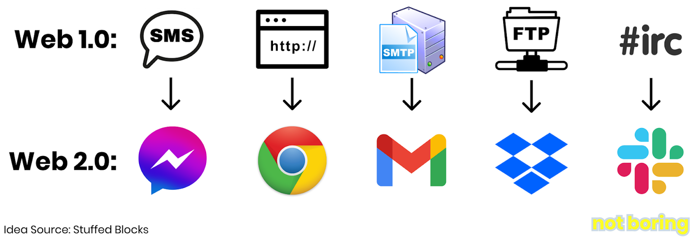
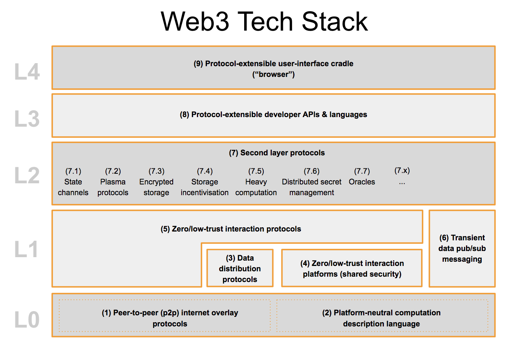
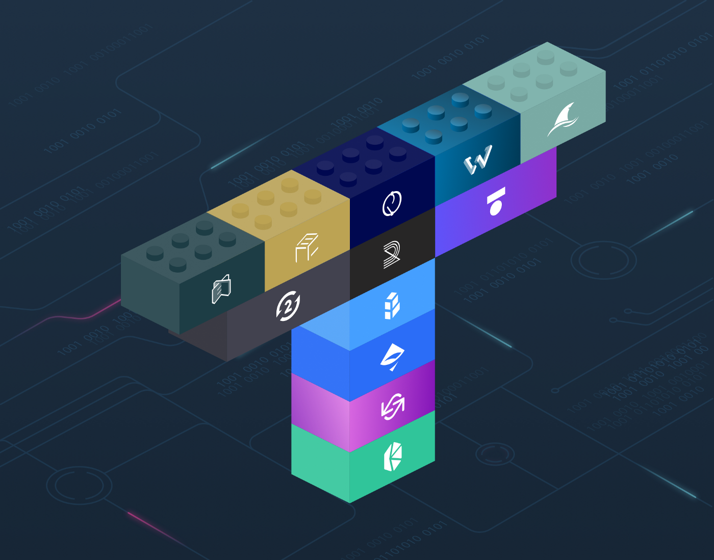
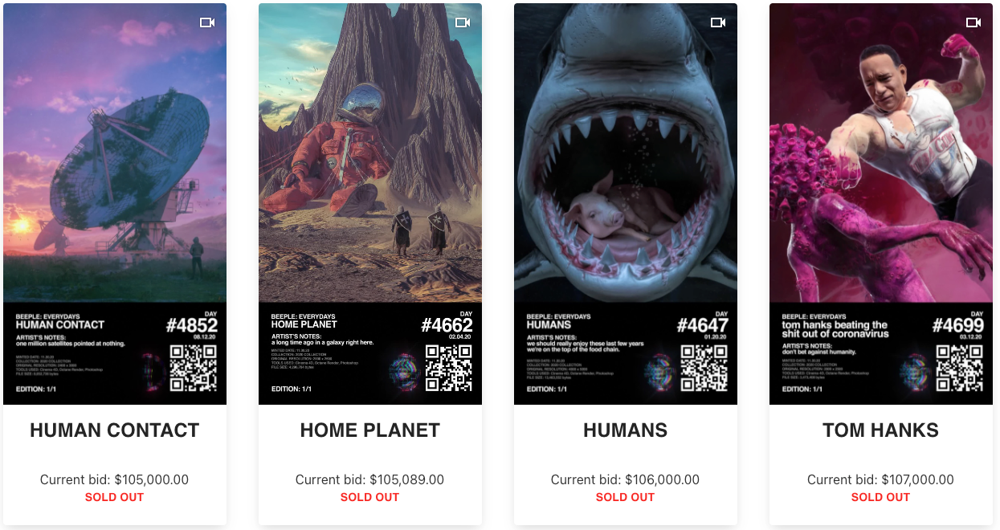
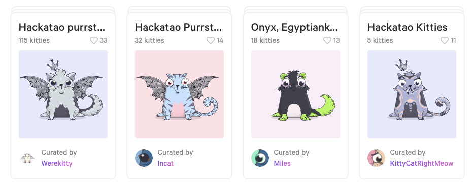

# Web3, NFT's and  Metaverse
___

## What is Web3?

Web3 is a return to the vision of the early internet, with built-in superpowers.

As explained by [Decrypt](https://decrypt.co/resources/what-is-web-3): “the next major iteration of the Internet, which promises to wrest control from the centralized corporations that today dominate the web by only a [handful of powerful companies](https://www.economist.com/leaders/2017/05/06/the-worlds-most-valuable-resource-is-no-longer-oil-but-data)

> It says what Web3 is against, not what it’s for.

## To understand what Web3 is we must first know what came first. 

## Web 1.0
The early internet in the 1980s through the early 2000s, Web 1.0, was decentralized. It was built on top of a series of open protocols that anyone could build directly on top of
- `HTTP` for websites
- `SMTP` for email
- `SMS` for messaging
- `IRC` for chat 
- `FTP` for file transfer. 
  
The benefit was that these protocols were generally agreed upon and not subject to change; I could build a website on HTTP and if people had my website address, they could go directly to my site, not intermediated by anyone else.

> It was a direct relationship between creator and consumer.

### Major Challenges though...

The first phase of the Internet and can be characterized by the way users initially interacted with the web. Most users, during the first iteration of the web, were passive consumers of content. In other words, Web 1.0 was about reading and not writing. It was static instead of dynamic. 

 - **Stateless**. Web 1.0 protocols were stateless, meaning that they didn’t capture state, or user data. “Capturing user data” has negative connotations today, but stateless protocols meant that website owners didn’t even know whether I’d visited a site before, and couldn’t tailor experiences accordingly.
 - **Too Technical**. You needed to be technical to build a presence on Web 1.0, which meant that regular people were left out.
 - **Missing Protocols**. Web 1.0 didn’t have standard protocols for many of the things that power the internet today: payments, search, apps, social media, commerce, credit, and more.
 - **Protocols Didn’t Make Money!** Imagine developing HTTP, seeing trillions of dollars worth of value being built on top of it, and not being able to participate in the upside aside from some speaking fees, consulting gigs, and book sales. Oof.

...This changed with Web 2.0.

## Web 2.0
(mid-2000s to present) emerged as entrepreneurs recognized the holes in Web 1.0 and built products to fill them in, and capture the value in the process.
The next major phase of the Internet was all about interactivity and users.

In this phase, users created most of the content on platforms such as YouTube, Facebook, or Twitter. This Internet was more social and collaborative, but that usually came at a price. The downside of this more participatory Internet was that by creating content, users were also providing personal information and data to the companies that controlled these platforms.

> These companies didn’t just capture state, they aggregated it, building up huge troves of valuable user data.

> Internet 2.0 showed us the power of networks. In the absence of open protocols, state aggregators acted as protocols for new areas. 

## Web 2.0 is SOFA KING Awesome!!
We can all build these UI's, communicate seamlessly and effortlessly with very little effort, and aggregated this content with little of NO technical knowledge.

## Is it though?
### There are challanges

 - Twitter, for example, can shut down my account whenever it wants to... and has done so w/ the President of the United States. 
 - Facebook famously allowed brands and publishers to build up audiences on a seemingly free platform, and then changed the rules, forcing them to pay to reach their own audiences. 

In the beginning, centralized platforms do anything they can to attract users, developers, and businesses in order to build up multi-sided network effects.

They start with the **attract** method to gain users but ultimately turn this into an **Extract** method to monitize from those users.
The easiest way to grow revenue is to start charging businesses and developers to reach customers, and to serve customers ads or products based on the data they’ve accumulated. 

So in short the application state is now being used as a tool to target and monitize users based on the domain knowledge that **YOU** gave them. 

Ha ha! And who has control over this highly valueable data. Not you, but the corporations that rule the network.  

## What is Web 3?
Web3 is the next version of the internet, built on top of crypto-economic networks, like Bitcoin and Ethereum.

- Verifiable
- Trustless
- Self-governing
- Permissionless
- Stateful
- Native built-in payments 
  
In Web3, developers don't build and deploy applications that run on a single server or that store their data in a single database (usually hosted on and managed by a single cloud provider).

Instead, Web3 applications either run on blockchains, decentralized networks of many peer to peer nodes (servers), or a combination of the two that forms a cryptoeconomic protocol. These apps are often referred to as dapps (decentralized apps), and you will see that term used often in the Web3 space.

> “Cryptonetworks combine the best features of the first two internet eras: community-governed, decentralized networks with capabilities that will eventually exceed those of the most advanced centralized services.”

It is currently still being built, so there is no single, established definition yet of what Web 3 is or will be.
In general, those involved in blockchain or (smart-contract) platforms, such as Ethereum*, [EOS](https://decrypt.co/resources/eos), and [TRON](https://decrypt.co/resources/tron), are recognized as leading the way for Web 3.

> Ethereum - A blockchain project conceived by Vitalik Buterin that allows developers to build decentralized apps (dapps) using Smart Contracts.
> 
### At the heart of Web3 is the idea of consensus protocols and standards with money baked in.
#### Building on the progress of others

It's like a series of open source API's that anyone can build according to an agreed set of rules that gain financial value over time which is shared with everyone who contributes to this API. 
So.. instead of building siloed products, **WEB3** is build for interoperability. 
 - Can we pull a Volvo?... Capitalism With A Conscience — [Volvo’s Great Act of Generosity](https://www.forbes.com/sites/douglasbell/2019/08/13/60-years-of-seatbelts-volvos-great-gift-to-the-world/?sh=5a39abea22bc) 

**Decentralized Finance (“DeFi”)**, which, as the name implies, is attempting to build a new financial system without central financial institutions, is one of the most promising layers being built on Web3.

The main differences between Web 2.0 and Web3 are Levels 0-2, and the implications of the architecture on where **the value accrues within the system**. This is based on the analogy of [money legos](https://medium.com/totle/building-with-money-legos-ab63a58ae764). 

> Using a bunch of APIs that are really flexible, and figuring out good ways to connect them, leads to a combinatorial explosion of potential workflows. API-first companies turn software into like customizable building blocks.

### Web 2.0 Value Chain
| Supplier      | `Aggregator $$$`| Consumer  |
| ------------- |:-------------:| -----:|

### Web 3.0 Value Chain
| `Supplier $$$`     | ~~Aggregator~~   | `Consumer $$$` |
| ------------- |:-------------:| -----:|

> $$$ is built into the web3 protocols. Bitcoin and Ethereum, the two main protocols on which Web3 is built, both have mechanisms for rewarding contributors baked directly into the code
> Web3 enables the new value chains that emerge when the middleman is removed.

ex. Tolto Lego Pieces:
- KyberNetwork
- Uniswap
- AirSwap
- Bancor
- Radar Relay
- Eth2Dai
- TokenStore
- Ethex
- ERC deX
- OpenRelay
- WeiDex
- SharkRelay

## Non-Fungible Tokens and Digital Ownership

Beeple’s Everydays auction was omposed of digital art backed by non-fungible tokens (NFTs) used to prove the validity, ownership, and scarcity of digital items or experiences.  
Between December 11th and December 13th, an artist named Mike Winkelmann, who goes by Beeple, sold his works directly to collectors via online auction house Nifty Gateway.
Oh, and over the course of those three days, Beeple earned $3.5 million.

3 years before Beeples

CryptoKitties is a blockchain game on Ethereum developed by Canadian studio Dapper Labs that allows players to purchase, collect, breed and sell virtual cats. It is one of the earliest attempts to deploy blockchain technology for recreation and leisure. The game's popularity in December 2017 congested the Ethereum network, causing it to reach an all-time high in the number of transactions and slowing it down significantly.

### How do you use Web 3?
There are many Web 3 dapps that are currently available. One of the most popular and promising products involves decentralized finance (or DeFi) tools through which users can lend and borrow, tokenize real-world assets, make predictions, invest, and trade crypto assets. Playing games, gambling, and making predictions are also popular ways to use Web 3.

Surf the Web3 landscape https://medium.com/the-ethereum-name-service/all-the-ways-you-can-surf-the-decentralized-web-today-bf8e7a42fa27

refs.

https://www.notboring.co/p/the-value-chain-of-the-open-metaverse
https://decrypt.co/resources/what-is-web-3
https://en.wikipedia.org/wiki/CryptoKitties
https://medium.com/the-ethereum-name-service/all-the-ways-you-can-surf-the-decentralized-web-today-bf8e7a42fa27
https://www.freecodecamp.org/news/what-is-web3/
